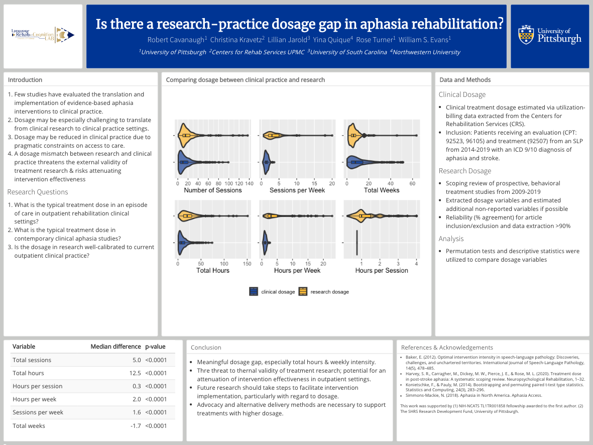

# flex.poster

Stop using powerpoint for posters. No really, life can be easier.

## Overview

Modified version of the postr package from [Oscar de
Leon](https://github.com/odeleongt) with changes from [Luke
Johnston](https://github.com/lwjohnst86). Also big thanks to the tutial
[here](https://wytham.rbind.io/post/making-a-poster-in-r/) by Wei Yan
Tham. This package consists of some minor updates and incorporating some
functionality I liked from
[posterdown](https://github.com/brentthorne/posterdown), which is
another good option for poster templates in Rmarkdown. Full disclosure:
I have no idea what I’m doing.

> This package provides templates and helper functions to prepare R
> Markdown based conference posters with a free and reproducible
> workflow and produce output both in html for hosting and png for
> printing. Relies on the flexdashboard package to easily define poster
> layout.

But really, making a poster with
[flexdashboard](https://rmarkdown.rstudio.com/flexdashboard/) is as
relative straightforward: writing the rmarkdown text, checking the
sizing formatting, rendering any images within the poster or just
loading pre-rendered images, and rendering any tables. I did this to
save time for my future self and automated it.

source: <https://imgs.xkcd.com/comics/automation.png>

## Dependencies

> This poster template depends on the following R packages

-   rmarkdown
-   flexdashboard
-   webshot2

## Preparing a new poster

In order to use this poster template, you need to:

1.  Install from github
    `devtools::install_github("rbcavanaugh/flex.poster")`

2.  Create a new R Markdown document in Rstudio based on the poster
    template, or run
    `rmarkdown::draft("my_poster.Rmd", template = "poster", package = "flex.poster")`

    -   The title, author, and affiliations in the YAML header will
        correspond to the title, authors, and affiliations helper
        functions. They can also be direct accessed through
        `rmarkdown::metadata`

3.  Render the poster as an html file:
    `rmarkdown::render("my_poster.Rmd")` (or just hit knit in rstudio).
    set render\_print: to false until you’re ready to make the poster.

4.  Convert the html file as a printable image:

    `flex.poster::render_poster_image("my_poster.html")`. File
    conversion is done by taking a screenshot of the rendered HTML doc.

*note this update does not use webshot/phantonJs, but uses webshot2
which does not require phantonJs but does require chrome to be installed
in your computer. see <https://github.com/rstudio/webshot2>*

## Example

A new poster! Not quite done yet…

## Tips

-   A workflow to creating a poster should (1) create a subdirectory or
    rproject for the folder (2) save the template file as your own
    document (3) save any images/logos/pre-renderedplot/data in the same
    folder or use subfolders to organize these resources. (4) Add your
    content!
-   [flexdashboard](https://rmarkdown.rstudio.com/flexdashboard/) has
    great documentation for designing your desired layout.
-   `?render_poster_image` will provide possible arguments for rendering
    options (e.g. portrait aspect ratio)
-   After knitting the poster, you can preview how it will look after
    the screenshot by opening the html file in google chrome (show in
    new window in the Rstudio viewer), clicking on “toggle device
    toolbar” and setting the dimensions to the viewport dimensions from
    `render_poster_image`. The default width is 1600 pixels x 1200
    pixels for height. I’ve found this to generate reasonable font sizes
    for the amount of information I want to include on a poster, but a
    smaller window will result in larger font and larger windows will
    result in smaller fonts. You can also change the font explicitly in
    the rmarkdown document using html tags.
-   use xaragin::inf\_mr() to automatically re-render the document
    everytime you save.
-   A CSS code chunk is at the top of the template document. You can
    change these values to change the look of the document. You can also
    add your own CSS document in the YAML if preferred.
-   If your university has font/color branding guidelines, they can be
    replicated exactly in the CSS
-   Chunk options for r or other code chunks are here:
    <https://rmarkdown.rstudio.com/lesson-3.html>
-   I haven’t tried it yet, but presumably you could theme your poster
    using [bslib](https://rstudio.github.io/bslib/) which provides easy
    themes for flexdashboard…

## References

-   JJ Allaire, Yihui Xie, Jonathan McPherson, Javier Luraschi, Kevin
    Ushey, Aron Atkins, Hadley Wickham, Joe Cheng and Winston Chang
    (2017). rmarkdown: Dynamic Documents for R. R package version 1.8.
    <https://CRAN.R-project.org/package=rmarkdown>
-   Barbara Borges and JJ Allaire (2017). flexdashboard: R Markdown
    Format for Flexible Dashboards. R package version 0.5.1.
    <https://CRAN.R-project.org/package=flexdashboard>
-   Winston Chang (2021). webshot2: Take Screenshots of Web Pages. R
    package version 0.0.0.9000.
-   Oscar de León (2021). postr: Prepare reproducible posters using R
    Markdown. R package version 0.0.0.9000.
    <https://github.com/odeleongt/postr>
